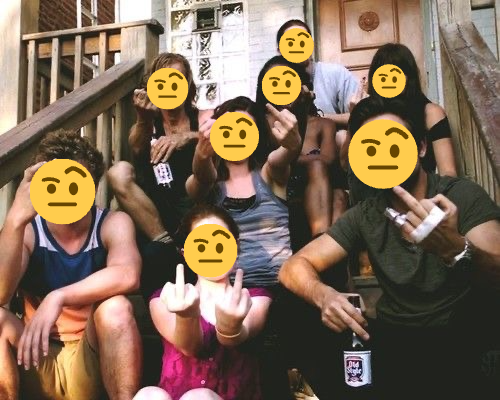

# 🫣 No Face / カオナシ

[English](#english) | [中文](#中文)

<p align="center">
  
  
</p>
<p align="center"><i>One click, every face becomes an emoji — right in your browser.</i></p>

---

<a name="english"></a>

## English

> Privacy-first face masking tool - Replace faces with emojis, all processing done locally.

### ✨ Features

- 📤 **Multiple upload methods** - Drag & drop, click to select, or use camera on mobile
- 🔍 **Automatic face detection** - Powered by MediaPipe FaceDetector running in a Web Worker
- 😀 **Curated emoji picker** - 110 carefully selected emojis with Chinese keyword search and random-pick button
- 🎯 **Quick editing** - Click to replace individual faces or apply the same emoji to everyone at once
- 📏 **Global emoji size control** - Adjust all emojis uniformly with a slider (0.8–1.6×)
- 💾 **High-quality export** - Download images in original resolution (PNG)
- 📱 **Responsive design** - Works seamlessly on desktop, tablet, and mobile
- 🔒 **Privacy-focused** - All processing happens in your browser, no server uploads
- ✨ **Smooth animations** - Duolingo-inspired interface with Framer Motion
- ⏮️ **Undo/Redo** - Full history stack with keyboard shortcuts (Ctrl/Cmd+Z / Ctrl/Cmd+Shift+Z)

### 🚀 Quick Start

#### Prerequisites

- Node.js 18+ or Bun
- npm, yarn, or bun package manager

#### Installation

```bash
# Clone the repository
git clone https://github.com/BazingaOrg/no-face.git
cd no-face

# Install dependencies
npm install
# or
bun install

# Run development server
npm run dev
# or
bun run dev

# Build for production
npm run build
npm start
```

Visit [http://localhost:3000](http://localhost:3000) to see the app.

### 🎮 How to Use

1. **Upload** - Select an image or use camera (mobile)
2. **Detect** - App automatically detects all faces
3. **Choose** - Pick an emoji from the curated set or use the random button
4. **Replace** - Click individual face badges to apply the emoji, or click "Replace All" to apply to everyone
5. **Adjust** - Use the size slider to scale all emojis uniformly; drag individual emojis to fine-tune positioning
6. **Export** - Download your creation in original quality

### 🛠️ Tech Stack

- **Framework**: [Next.js 15](https://nextjs.org/) (App Router)
- **Language**: [TypeScript](https://www.typescriptlang.org/)
- **Styling**: [Tailwind CSS v4](https://tailwindcss.com/)
- **Face Detection**: [@mediapipe/tasks-vision](https://github.com/google-ai-edge/mediapipe) (FaceDetector, in a Web Worker)
- **Emoji**: [emoji-picker-react](https://github.com/ealush/emoji-picker-react) + [Twemoji](https://github.com/twitter/twemoji)
- **Animation**: [Framer Motion](https://www.framer.com/motion/)

### 📂 Project Structure

```plaintext
no-face/
├── app/
│   ├── page.tsx              # Main application page
│   └── layout.tsx            # Root layout
├── components/
│   ├── ImageUploader.tsx     # Drag & drop + camera
│   ├── FaceCanvas.tsx        # Interactive face detection canvas
│   ├── EmojiToolbar.tsx      # Emoji picker + size slider + search
│   ├── AppHeader.tsx         # Compact header (editing mode) or full header (empty state)
│   ├── AppFooter.tsx         # Footer with credits (hidden on mobile)
│   ├── IconButton.tsx        # 40×40 icon button component
│   ├── ModelLoadingModal.tsx # Model loading progress modal
│   ├── ProcessingOverlay.tsx # Detection progress overlay
│   └── Toast.tsx             # Toast notifications (with undo action)
├── hooks/
│   ├── useFaceBadgeLayout.ts         # Badge positioning helper
│   ├── useFrameDebouncedCallback.ts  # Frame-synchronised debounce hook
│   └── useHistoryStack.ts            # Undo/redo history management
├── workers/
│   └── faceDetection.worker.ts # MediaPipe FaceDetector, off the main thread
├── lib/
│   ├── faceDetectorClient.ts # Main-thread Worker client (init/detect/dispose)
│   ├── runFaceDetection.ts   # Normalised detection pipeline
│   ├── twemoji.ts            # Twemoji CDN utilities
│   ├── emojiImageCache.ts    # Shared emoji bitmap cache
│   └── emojiRenderUtils.ts   # Emoji sizing & shared draw routine
├── utils/
│   └── imageOptimization.ts  # Large-image downscaling for detection
├── types/
│   └── index.ts              # TypeScript type definitions
├── public/models/            # Face detection model (self-hosted)
├── public/mediapipe/wasm/    # MediaPipe WASM runtime (self-hosted)
├── docs/                     # Design specs & improvement plans
├── docs/plans/            # Step-by-step plan docs (source of truth for TODOs)
├── MODELS_SETUP.md           # Model setup guide
└── CLAUDE.md                 # Developer documentation
```

### ⚙️ Configuration

#### Face Detection

- **Detector**: MediaPipe full-range BlazeFace, running in a dedicated Web Worker (GPU delegate preferred, CPU fallback)
- **Sensitivity**: A single adjustable confidence threshold (0.1-0.9)
- **Assets**: Self-hosted model (`public/models/`) and WASM runtime (`public/mediapipe/wasm/`) — see [MODELS_SETUP.md](./MODELS_SETUP.md)

#### Emoji Settings

- **Format**: SVG (vector, via Twemoji)
- **Size**: Global slider (0.8–1.6×) adjusts all emojis uniformly
- **Position**: Click and drag individual emojis to fine-tune positioning on their faces

### 📋 Roadmap

See [docs/plans/2026-07-17-perf-and-model-optimization.md](./docs/plans/2026-07-17-perf-and-model-optimization.md) for the current plan.

**MVP Completed** ✅
- Image upload, face detection, emoji replacement
- Advanced settings panel & per-face inspector
- Drag to reposition an emoji on the inspected face
- Mobile responsive design
- Full Undo/Redo history (buttons + Ctrl/Cmd+Z / Ctrl/Cmd+Shift+Z)
- Chinese keyword search over a curated emoji set
- PWA offline support

**Planned Features**
- Real-time camera mode (in design)
  - Live face tracking via the existing MediaPipe Worker, switched to `runningMode: 'VIDEO'`
  - Streamlined UI entry alongside the existing uploader with a dedicated state machine
  - Real-time emoji overlay with smoothing, pause, and snapshot controls
- Video recording with emoji effects
  - Use `HTMLCanvasElement.captureStream` + `MediaRecorder` for WebM/MP4 output
  - Optional microphone track merge and adaptive FPS/resolution controls for low-end devices
  - Post-recording export flow aligned with current PNG workflow
- PWA support

### 🐛 Known Issues

- Large images are auto-downscaled to 1920px for detection (export keeps original quality)
- Browser compatibility testing in progress (Chrome/Edge/Firefox/Safari)

### 🤝 Contributing

Contributions are welcome! Please check [docs/plans/](./docs/plans/) for open tasks.

1. Fork the repository
2. Create your feature branch (`git checkout -b feature/AmazingFeature`)
3. Commit your changes (`git commit -m 'Add some AmazingFeature'`)
4. Push to the branch (`git push origin feature/AmazingFeature`)
5. Open a Pull Request

### 📄 License

MIT License - free for personal and commercial use.

### 🙏 Acknowledgments

- [MediaPipe](https://github.com/google-ai-edge/mediapipe) by Google - Face detection models
- [Twemoji](https://github.com/twitter/twemoji) by Twitter - High-quality emoji graphics
- [face-mask-web](https://github.com/Innei/face-mask-web) by Innei - Inspiration for this project

---

<a name="中文"></a>

## 中文

> 隐私优先的人脸遮罩工具 - 用 Emoji 替换人脸，所有处理均在本地完成。

### ✨ 功能特性

- 📤 **多种上传方式** - 拖放上传、点击选择或移动端相机拍摄
- 🔍 **自动人脸检测** - 基于 MediaPipe FaceDetector，运行在 Web Worker 中
- 😀 **精选表情库** - 精心挑选的 110 个 Emoji，支持中文关键词搜索与随机选择
- 🎯 **快速编辑** - 单击替换单张人脸，或一键应用给所有人
- 📏 **全局大小滑块** - 统一调整所有表情尺寸（0.8–1.6倍）
- 💾 **高质量导出** - 下载原始分辨率图片（PNG 格式）
- 📱 **响应式设计** - 完美适配桌面、平板和移动设备
- 🔒 **隐私保护** - 所有处理在浏览器本地完成，无服务器上传
- ✨ **流畅动画** - Duolingo 风格界面，基于 Framer Motion
- ⏮️ **撤销/重做** - 完整历史栈，支持键盘快捷键（Ctrl/Cmd+Z / Ctrl/Cmd+Shift+Z）

### 🚀 快速开始

#### 环境要求

- Node.js 18+ 或 Bun
- npm、yarn 或 bun 包管理器

#### 安装步骤

```bash
# 克隆仓库
git clone https://github.com/BazingaOrg/no-face.git
cd no-face

# 安装依赖
npm install
# 或
bun install

# 启动开发服务器
npm run dev
# 或
bun run dev

# 构建生产版本
npm run build
npm start
```

访问 [http://localhost:3000](http://localhost:3000) 查看应用。

### 🎮 使用方法

1. **上传图片** - 选择图片或使用相机（移动端）
2. **检测人脸** - 应用自动检测所有人脸
3. **选择表情** - 从精选表情库中挑选 Emoji 或使用随机按钮
4. **替换人脸** - 点击人脸标签应用表情，或点击"全部替换"一次应用给所有人
5. **调整** - 用大小滑块统一调整所有表情的尺寸；拖拽单个表情微调位置
6. **导出图片** - 下载原始质量的作品

### 🛠️ 技术栈

- **框架**: [Next.js 15](https://nextjs.org/) (App Router)
- **语言**: [TypeScript](https://www.typescriptlang.org/)
- **样式**: [Tailwind CSS v4](https://tailwindcss.com/)
- **人脸检测**: [@mediapipe/tasks-vision](https://github.com/google-ai-edge/mediapipe)（FaceDetector，运行于 Web Worker）
- **表情包**: [emoji-picker-react](https://github.com/ealush/emoji-picker-react) + [Twemoji](https://github.com/twitter/twemoji)
- **动画**: [Framer Motion](https://www.framer.com/motion/)

### 📂 项目结构

```plaintext
no-face/
├── app/
│   ├── page.tsx              # 主应用页面
│   └── layout.tsx            # 根布局
├── components/
│   ├── ImageUploader.tsx     # 拖放上传 + 相机
│   ├── FaceCanvas.tsx        # 交互式人脸检测画布
│   ├── EmojiToolbar.tsx      # 表情选择器 + 大小滑块 + 搜索
│   ├── AppHeader.tsx         # 紧凑头部（编辑态）或完整头部（空态）
│   ├── AppFooter.tsx         # 页脚（移动端隐藏）
│   ├── IconButton.tsx        # 40×40 图标按钮组件
│   ├── ModelLoadingModal.tsx # 模型加载进度弹窗
│   ├── ProcessingOverlay.tsx # 检测进度遮罩
│   └── Toast.tsx             # 提示条（支持撤销操作）
├── hooks/
│   ├── useFaceBadgeLayout.ts         # 人脸标签定位
│   ├── useFrameDebouncedCallback.ts  # 帧同步防抖
│   └── useHistoryStack.ts            # 撤销/重做历史管理
├── lib/
│   ├── faceDetectorClient.ts # 主线程 Worker 封装（init/detect/dispose）
│   ├── runFaceDetection.ts   # 标准化检测管线
│   ├── twemoji.ts            # Twemoji CDN 工具
│   ├── emojiImageCache.ts    # Emoji 位图共享缓存
│   └── emojiRenderUtils.ts   # Emoji 尺寸与统一绘制
├── utils/
│   └── imageOptimization.ts  # 大图压缩与坐标映射
├── types/
│   └── index.ts              # TypeScript 类型定义
├── public/models/            # 人脸检测模型（本地托管）
├── public/mediapipe/wasm/    # MediaPipe WASM 运行时（本地托管）
├── docs/                     # 设计规范与改进方案
├── docs/plans/            # 分步执行方案（待办事项唯一来源）
├── MODELS_SETUP.md           # 模型配置指南
└── CLAUDE.md                 # 开发者文档
```

### ⚙️ 配置说明

#### 人脸检测

- **检测器**: MediaPipe full-range BlazeFace，运行于独立 Web Worker（优先 GPU delegate，失败自动回退 CPU）
- **灵敏度**: 固定阈值 0.5，未检测到脸时自动降级到 0.3 重试一次
- **资源托管**: 模型（`public/models/`）与 WASM 运行时（`public/mediapipe/wasm/`）均本地托管，详见 [MODELS_SETUP.md](./MODELS_SETUP.md)

#### Emoji 设置

- **格式**: SVG（矢量，来自 Twemoji）
- **大小**: 全局滑块统一调整（0.8–1.6倍）
- **位置**: 点击并拖拽单个表情微调在人脸上的位置

### 📋 开发路线图

详见 [docs/plans/2026-07-17-perf-and-model-optimization.md](./docs/plans/2026-07-17-perf-and-model-optimization.md)。

**MVP 已完成** ✅
- 图片上传、人脸检测、Emoji 替换
- 高级设置面板与单脸微调抽屉
- 拖动调整微调中人脸的 Emoji 位置
- 移动端响应式设计
- 完整撤销/重做历史栈（按钮 + Ctrl/Cmd+Z / Ctrl/Cmd+Shift+Z）
- 精选表情的中文关键词搜索
- PWA 离线支持

**计划功能**
- 实时相机模式

### 🐛 已知问题

- 大图片会自动压缩到 1920px 用于检测（导出保持原始画质）
- 浏览器兼容性测试进行中（Chrome/Edge/Firefox/Safari）

### 🤝 参与贡献

欢迎贡献代码！请查看 [docs/plans/](./docs/plans/) 了解待完成任务。

1. Fork 本仓库
2. 创建特性分支 (`git checkout -b feature/AmazingFeature`)
3. 提交更改 (`git commit -m 'Add some AmazingFeature'`)
4. 推送到分支 (`git push origin feature/AmazingFeature`)
5. 开启 Pull Request

### 📄 许可证

MIT 许可证 - 可免费用于个人和商业用途。

### 🙏 致谢

- [MediaPipe](https://github.com/google-ai-edge/mediapipe) by Google - 人脸检测模型
- [Twemoji](https://github.com/twitter/twemoji) by Twitter - 高质量 Emoji 图形
- [face-mask-web](https://github.com/Innei/face-mask-web) by Innei - 项目灵感来源

---

**Privacy Note / 隐私声明**: All image processing happens in your browser. No data is uploaded to any server. / 所有图片处理均在浏览器本地完成，不会上传任何数据到服务器。
